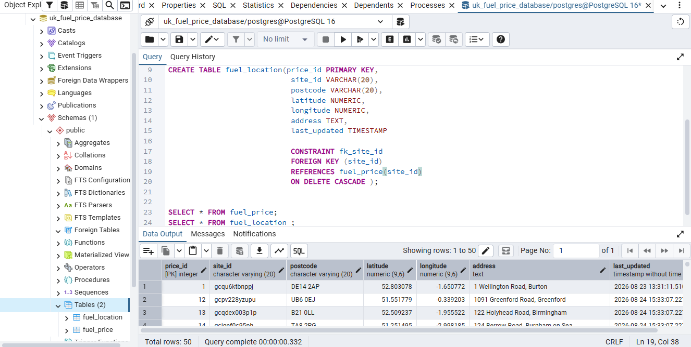

# UK Fuel Price ETL Pipeline


## Overview


This project is an automated ETL pipeline that extracts UK fuel price data from **API Hub**, transforms and cleans the data using Python, and loads the processed data into a **PostgreSQL database**.

The pipeline is orchestrated using **Apache Airflow** and scheduled to run automatically every **10 minutes**. Docker is used to containerize the Airflow environment and supporting services.

---

## Technologies Used


* Python
* Pandas
* PostgreSQL
* Apache Airflow
* Docker
* Docker Compose
* REST API
* API Hub
* Git & GitHub

---

## Data Source


The fuel price data used in this project was obtained through **API Hub**.

The API provides UK fuel price information that is extracted programmatically and passed through the ETL pipeline for processing and storage.

The extraction process is implemented in:

```text
scripts/extract.py
```

---

## ETL Pipeline


The pipeline follows a standard **Extract, Transform, Load (ETL)** architecture:

```text
API Hub
   │
   ▼
Extract
   │
   ▼
Transform
   │
   ▼
Load
   │
   ▼
PostgreSQL
```

Apache Airflow is responsible for orchestrating and scheduling the entire workflow.

---

## Airflow DAG


### DAG Workflow


[Airflow DAG](Dags_Image.png)

The ETL workflow is orchestrated using **Apache Airflow** through the `fuel_etl_dag.py` DAG.

The DAG coordinates the following tasks:

* Extract fuel price data
* Transform and clean the data
* Load the processed data into PostgreSQL

Airflow provides a graphical representation of the workflow and allows each task to be monitored independently.

---

## Database


### PostgreSQL Database




The processed fuel price data is stored in a **PostgreSQL database**.

PostgreSQL was selected as the database layer to provide structured, persistent storage for the processed data and allow the data to be queried using SQL.

---

## Data Extraction


The extraction stage retrieves UK fuel price data from **API Hub** using the API.

The extraction logic is contained in:

```text
scripts/extract.py
```

The extracted data is then passed to the transformation stage.

---

## Data Transformation


The transformation stage prepares the extracted data for storage in PostgreSQL.

The transformation logic is contained in:

```text
scripts/transform.py
```

Transformation operations include:

* Cleaning the extracted data
* Preparing data fields
* Formatting the dataset
* Preparing the data for database insertion

---

## Data Loading


The loading process is implemented in:

```text
scripts/load.py
```

The transformed fuel price data is loaded into the PostgreSQL database.

This completes the ETL workflow:

```text
Extract → Transform → Load
```

---

## Logging and Monitoring


### Pipeline Logs


[Logs](Logs_Image.png)

Apache Airflow provides logs for monitoring the execution of individual ETL tasks.

The logs help to:

* Track pipeline execution
* Monitor task status
* Identify errors
* Troubleshoot failed tasks
* Monitor pipeline reliability

---

## Automation


The ETL pipeline is scheduled using **Apache Airflow** and runs automatically every **10 minutes**.

```text
Schedule: Every 10 minutes
```

This automation eliminates the need to manually execute the ETL scripts and allows the database to be periodically updated with newly extracted fuel price data.

---

## Docker Containerization


Docker is used to containerize the project environment.

The Docker configuration is located in:

```text
docker/
├── docker-compose.yml
└── dockerfile
```

Docker Compose manages the services required to run the Airflow-based pipeline.

---

## Project Structure


```text
ETL_Project_1.2/
│
├── dags/
│   └── fuel_etl_dag.py
│
├── data/
│
├── docker/
│   ├── docker-compose.yml
│   └── dockerfile
│
├── logs/
│
├── scripts/
│   ├── __init__.py
│   ├── extract.py
│   ├── load.py
│   └── transform.py
│
├── .env
├── .gitignore
├── Dags_Image.png
├── Database_image.png
├── Logs_Image.png
└── requirements.txt
```

---

## Key Features


* Automated UK Fuel Price Data Extraction
* API Integration using API Hub
* Data Cleaning and Transformation
* PostgreSQL Database Integration
* Apache Airflow Orchestration
* Automated 10-Minute Scheduling
* Docker Containerization
* Modular ETL Architecture
* Pipeline Logging and Monitoring
* Environment Variable Configuration

---

## Future Improvements


* Implement incremental data loading
* Add automated data quality checks
* Add Airflow failure notifications
* Improve error handling and retry mechanisms
* Add pipeline monitoring and alerting
* Connect PostgreSQL to Power BI
* Deploy the pipeline to AWS or Azure
* Implement CI/CD using GitHub Actions

---

## Author


**Rabiu Abdulgafar Eniola**

Aspiring Data Engineer | Python | SQL | PostgreSQL | Apache Airflow | Docker | ETL
